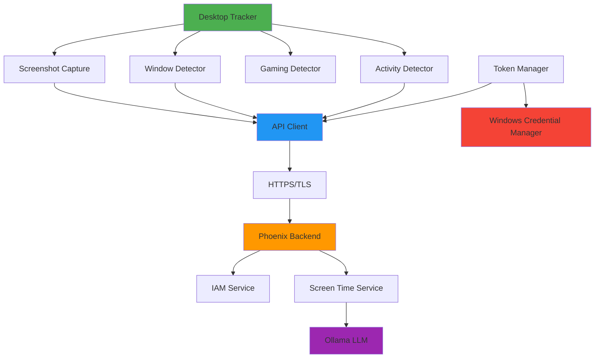

# Phoenix Desktop Screen Time Tracker

A production-ready desktop agent that securely captures screen context and usage data for the Phoenix Digital Homestead project.

## Features

✨ **Smart Screenshot Capture** - Uses SSIM-based change detection to only upload when screen content changes significantly

🔒 **Secure by Design** - HTTPS-only communication with JWT authentication via IAM service

🎮 **Gaming Mode** - Automatically pauses during gaming sessions to save resources

🪟 **Active Window Tracking** - Monitors which applications you're using

💓 **Heartbeat System** - Continuous activity monitoring every minute

🔐 **Secure Token Storage** - Uses Windows Credential Manager to safely store authentication tokens

⚡ **Resource Efficient** - Resizes images, compresses to JPEG, and implements rate limiting

## Architecture



## Installation

### Prerequisites

- Python 3.8 or higher
- Windows 10/11 (for full features)
- Phoenix Backend with HTTPS enabled

### Step 1: Clone or Download

```powershell
cd C:\path\to\your\projects
# If you have git
git clone <repository-url> phoenix-tracker
cd phoenix-tracker

# Or download and extract the ZIP file
```

### Step 2: Install Dependencies

```powershell
pip install -r requirements.txt
```

### Step 3: Configure

```powershell
# Copy the example configuration
copy .env.example .env

# Edit .env with your settings
notepad .env
```

Required settings:
- `PHOENIX_API_URL` - Your Phoenix server URL (must use HTTPS)
- `DEVICE_ID` - A unique identifier for this device

### Step 4: Set Up Authentication

Generate a device token from your Phoenix Web Dashboard:

1. Log into Phoenix Web Dashboard
2. Navigate to **Settings > Devices**
3. Click **"Generate New Device Token"**
4. Name it with your `DEVICE_ID` (e.g., "workstation-1")
5. Copy the token

Then run the setup wizard:

```powershell
python token_manager.py setup
```

Paste your token when prompted. It will be stored securely in Windows Credential Manager.

### Step 5: Test the Connection

```powershell
python desktop_tracker.py
```

You should see:
```
✅ Connected to Phoenix backend
✅ Tracker initialized successfully
```

Press `Ctrl+C` to stop.

## Usage

### Running Manually

```powershell
python desktop_tracker.py
```

### Running as a Background Service

See [INSTALL_WINDOWS.md](./INSTALL_WINDOWS.md) for instructions on setting up the tracker to run automatically on startup.

### Command Line Options

```powershell
# Set up or update authentication token
python token_manager.py setup

# View masked token (for verification)
python token_manager.py show

# Delete stored token
python token_manager.py delete

# Test window detection
python window_detector.py

# Test activity detection
python activity_detector.py

# Test gaming detection
python gaming_detector.py
```

## Configuration

All settings can be configured via the `.env` file or environment variables:

| Setting | Default | Description |
|---------|---------|-------------|
| `PHOENIX_API_URL` | `https://localhost:8000` | Phoenix backend URL (must be HTTPS) |
| `DEVICE_ID` | `workstation-<computername>` | Unique device identifier |
| `CAPTURE_INTERVAL` | `60` | Seconds between screenshot captures |
| `HEARTBEAT_INTERVAL` | `60` | Seconds between heartbeat updates |
| `SIMILARITY_THRESHOLD` | `0.95` | Image similarity threshold (0-1) |
| `GAMING_PROCESSES` | See config | Comma-separated list of gaming processes |
| `MAX_IMAGE_WIDTH` | `1024` | Maximum image width in pixels |
| `JPEG_QUALITY` | `70` | JPEG compression quality (1-100) |
| `VERIFY_SSL` | `true` | Verify SSL certificates |
| `REQUEST_TIMEOUT` | `30` | API request timeout in seconds |
| `LOG_LEVEL` | `INFO` | Logging level (DEBUG, INFO, WARNING, ERROR) |

### Gaming Process Blacklist

Add or remove processes from the gaming blacklist in `.env`:

```env
GAMING_PROCESSES=steam.exe,dota2.exe,csgo.exe,valorant.exe,fortnite.exe
```

When any of these processes are detected, the tracker will pause for 5 minutes.

## Privacy & Security

### Data Privacy

- **Local Processing**: All screenshots are analyzed by a local Ollama LLM running on your Phoenix server
- **Automatic Deletion**: Raw images are deleted immediately after LLM analysis
- **Text Only Storage**: Only the text summary is retained in the database
- **Private Network**: No data leaves your private network

### Security Features

- **HTTPS Only**: All communication uses TLS 1.2+ encryption
- **JWT Authentication**: Each request is authenticated via bearer token
- **Secure Storage**: Tokens stored in Windows Credential Manager
- **Rate Limiting**: Respects server rate limits (max 2 captures/minute)
- **Certificate Validation**: SSL certificates are verified by default

### Sensitive Data Handling

The tracker captures your screen, which may contain:
- Passwords (if visible)
- Personal information
- Proprietary work content

**Recommendations:**
- Only use on devices you control
- Ensure your Phoenix instance is properly secured
- Use VPN or private network access
- Regularly review captured contexts in the dashboard

## Troubleshooting

### "No authentication token found"

Run the token setup wizard:
```powershell
python token_manager.py setup
```

### "Authentication failed. Token may be invalid or expired"

Your token has expired or is invalid. Generate a new one from the Phoenix Dashboard and run setup again.

### "Connection test failed"

Check that:
1. Phoenix backend is running and accessible
2. `PHOENIX_API_URL` is correct in `.env`
3. SSL certificate is valid (or set `VERIFY_SSL=false` for testing)
4. Firewall allows outbound HTTPS connections

### Screenshots not uploading

This is normal if your screen content hasn't changed significantly. The tracker uses SSIM to detect changes and only uploads when there's meaningful activity.

To adjust sensitivity, lower the `SIMILARITY_THRESHOLD` in `.env` (e.g., `0.90`).

### "Rate limited" messages

The server is protecting itself from too many requests. The tracker will automatically retry after the cooldown period.

### High CPU usage

Try:
- Increasing `CAPTURE_INTERVAL` (e.g., `90` seconds)
- Reducing `MAX_IMAGE_WIDTH` (e.g., `800`)
- Lowering `JPEG_QUALITY` (e.g., `60`)

## Development

### Project Structure

```
phoenix-tracker/
├── desktop_tracker.py      # Main application
├── api_client.py           # Phoenix API client
├── token_manager.py        # Secure token storage
├── config.py               # Configuration management
├── window_detector.py      # Active window detection
├── activity_detector.py    # SSIM change detection
├── gaming_detector.py      # Gaming mode detection
├── requirements.txt        # Python dependencies
├── .env.example            # Configuration template
├── README.md               # This file
└── INSTALL_WINDOWS.md      # Windows installation guide
```

### Running Tests

Each module can be tested independently:

```powershell
python window_detector.py
python activity_detector.py
python gaming_detector.py
```

### Logging

Logs are written to:
- Console (stdout)
- `phoenix_tracker.log` (in the application directory)

Set `LOG_LEVEL=DEBUG` in `.env` for detailed logging.

## Support

For issues or questions:
1. Check the [troubleshooting section](#troubleshooting)
2. Review logs in `phoenix_tracker.log`
3. Verify configuration in `.env`
4. Test individual components using the test commands

## License

[Your License Here]

## Acknowledgments

Built for the Phoenix Digital Homestead project.
